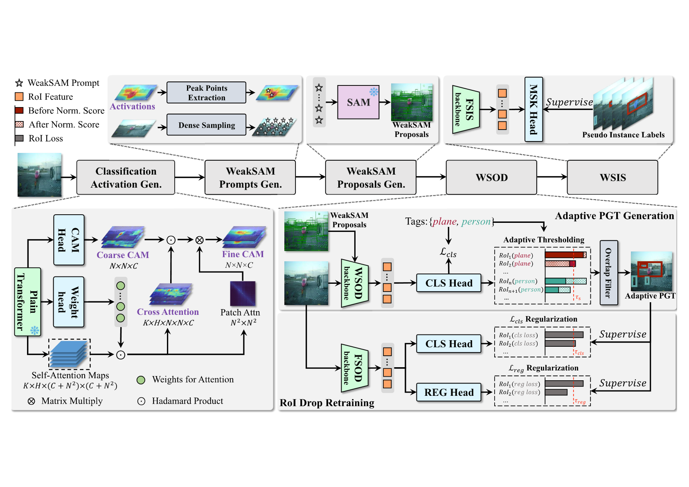

<div align="center">
<h1>WeakSAM </h1>
<h3>Segment Anything Meets Weakly-supervised Instance-level Recognition</h3>

[Lianghui Zhu](https://github.com/Unrealluver)<sup>1</sup> \*,[Junwei Zhou](https://github.com/Colezwhy)<sup>1</sup> \*,Yan Liu<sup>2</sup>, Xin Hao<sup>2</sup>, [Wenyu Liu](http://eic.hust.edu.cn/professor/liuwenyu/)<sup>1</sup>, [Xinggang Wang](https://xwcv.github.io/)<sup>1 :email:</sup>

<sup>1</sup>  School of EIC, Huazhong University of Science and Technology, <sup>2</sup>  Alipay Tian Qian Security Lab

(\*) equal contribution, (<sup>:email:</sup>) corresponding author.

ArXiv Preprint ([arXiv 2402.14812](https://arxiv.org/abs/2402.14812))

</div>

#

### News

* **` Feb. 22nd, 2024`:** We released our paper on Arxiv. Further details can be found in code and our updated [arXiv](https://arxiv.org/abs/2402.14812).


## Abstract

Weakly supervised visual recognition using inexact supervision is a critical yet challenging learning problem. It significantly reduces human labeling costs and traditionally relies on multi-instance learning and pseudo-labeling. This paper introduces WeakSAM and solves the weakly-supervised object detection (WSOD) and segmentation by utilizing the pre-learned world knowledge contained in a vision foundation model, i.e., the Segment Anything Model (SAM). WeakSAM addresses two critical limitations in traditional WSOD retraining, i.e., pseudo ground truth (PGT) incompleteness and noisy PGT instances, through adaptive PGT generation and Region of Interest (RoI) drop regularization. It also addresses the SAM's problems of requiring prompts and category unawareness for automatic object detection and segmentation. Our results indicate that WeakSAM significantly surpasses previous state-of-the-art methods in WSOD and WSIS benchmarks with large margins, i.e. average improvements of 7.4\% and 8.5\%, respectively.


<p align="middle">

</p>


## Overview

We first introduce classification clues and spatial points as automatic SAM prompts, which address the problem of SAM requiring interactive prompts. Next, we use the WeakSAM-proposals in the WSOD pipeline, in which the weakly-supervised detector performs class-aware perception to annotate pseudo ground truth (PGT). Then, we analyze the incompleteness and noise problem existing in PGT and propose adaptive PGT generation, RoI drop regularization to address them, respectively. Finally, we use WeakSAM-PGT to prompt SAM for WSIS extension. (The snowflake mark means the model is frozen.)

<p align="middle">

</p>


## Main results

For WSOD task:

|  Dataset | WSOD method | WSOD performance | Retrain method | Retrain performance |
|:--------:|:-----------:|:------------:|:--------------:|:-------------:|
|  VOC2007 |     WeakSAM(OICR)    |     [58.9 AP50](https://drive.google.com/file/d/12kC0Ur8NtTCs4ulEUV2MEpgskFr_oRH8/view?usp=drive_link)    |  Faster R-CNN  |      65.7 AP50      |
|          |             |                  |      DINO      |      66.1 AP50      |
|          |     WeakSAM(MIST)    |     [67.4 AP50](https://drive.google.com/file/d/1TGSttYUXD2xX3jY6DGrIdie9HLWCDMpZ/view?usp=drive_link)    |  Faster R-CNN  |      [71.8 AP50](https://drive.google.com/file/d/1A42FdW9xWad3z9cv919YJ2nVV32IQn6e/view?usp=drive_link)      |
|          |             |                  |      DINO      |      [73.4 AP50](https://drive.google.com/file/d/1WgPFsc9_LmL94GyoLJKzyT_QF3M2jXic/view?usp=drive_link)      |
| COCO2014 |     WeakSAM(OICR)    |     [19.9 mAP](https://drive.google.com/file/d/1MQGZHbaTZ-K1EYcppusk7X3Ob4AGi2CQ/view?usp=drive_link)     |  Faster R-CNN  |       22.3 mAP      |
|          |             |                  |      DINO      |       24.9 mAP      |
|          |     WeakSAM(MIST)    |     [22.9 mAP](https://drive.google.com/file/d/1LKJ7SJXw6OC4adqTjRT2uhhDax7ySeoB/view?usp=drive_link)     |  Faster R-CNN  |       [23.8 mAP](https://drive.google.com/file/d/1ePS2ECBfEmVjwevIV8FuMjj8Fx7M4xoK/view?usp=drive_link)      |
|          |             |                  |      DINO      |       [26.6 mAP](https://drive.google.com/file/d/1WgPFsc9_LmL94GyoLJKzyT_QF3M2jXic/view?usp=drive_link)      |

For WSIS task:

|  Dataset | Retrain method | AP25 | AP50 | AP70 | AP75 |
|:--------:|:--------------:|:------:|:------:|:------:|:------:|
|  VOC2012 |  Mask R-CNN  |      70.3      |      [59.6](https://pan.baidu.com/s/1BLbdg58xfOPilWMR6WPtEg?pwd=krsi)      |      43.1      |      36.2      |
|          |  Mask2Former |      73.4      |      [64.4](https://pan.baidu.com/s/1Wynqk1LRVrsaJiQHJxjCYQ?pwd=35am)      |      49.7      |      45.3      |


|  Dataset | Retrain method | AP\[50:95\] | AP50 | AP75 |
|:--------:|:--------------:|:------:|:------:|:------:|
|  COCOval2017 |  Mask R-CNN  |      [20.6](https://pan.baidu.com/s/1wdM_INhs6RGwCkxLtNb00Q?pwd=lss9)      |      33.9      |      22.0      |
|              |  Mask2Former |      [25.2](https://pan.baidu.com/s/1jmsTC4sAkgPdaTSjKR-W0g?pwd=r111)      |      38.4      |      27.0      |
|  COCOtest-dev |  Mask R-CNN  |      21.0      |      34.5      |      22.2      |
|               |  Mask2Former |      25.9      |      39.9      |      27.9      |

## Data & Preliminaries

- [Installing](docs/install.md)
- [Data preparation](docs/data_preparation.md)

## Generation & Training pipelines

- [Generation Pipeline](docs/generation.md)
- [WeakSAM-WSOD Pipeline](docs/training_wsod.md)
- [WeakSAM-WSIS Pipeline](docs/wsis_extension.md)


## Citation
If you find this repository/work helpful in your research, welcome to cite the paper and give a ⭐.
```
@article{zhu2024weaksam,
      title={WeakSAM: Segment Anything Meets Weakly-supervised Instance-level Recognition}, 
      author={Lianghui Zhu and Junwei Zhou and Yan Liu and Xin Hao and Wenyu Liu and Xinggang Wang},
      year={2024},
      eprint={2402.14812},
      archivePrefix={arXiv},
      primaryClass={cs.CV}
}
```

## Acknowledgement
Thanks for these wonderful works and their codebases! ❤️
[MIST](https://github.com/NVlabs/wetectron), [WSOD2](https://github.com/researchmm/WSOD2), [Segment-anything](https://github.com/facebookresearch/segment-anything), [WeakTr](https://github.com/hustvl/WeakTr), [SoS-WSOD](https://github.com/suilin0432/SoS-WSOD/tree/main)


